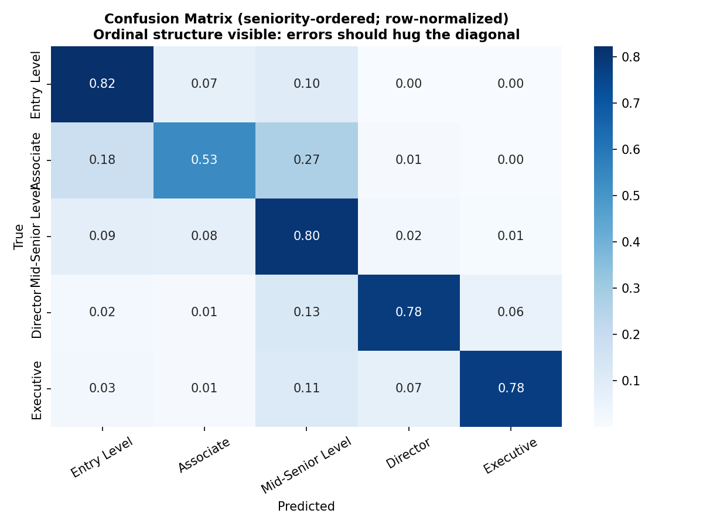
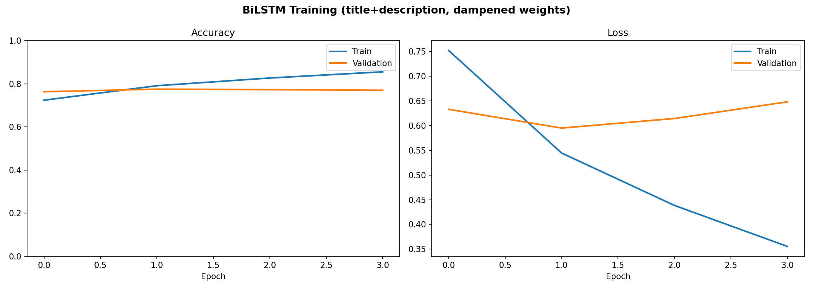
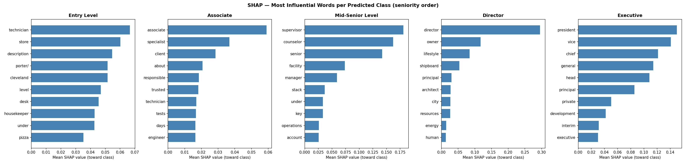
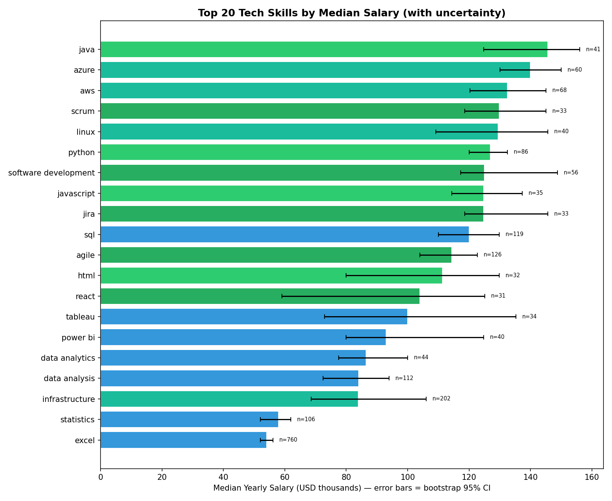
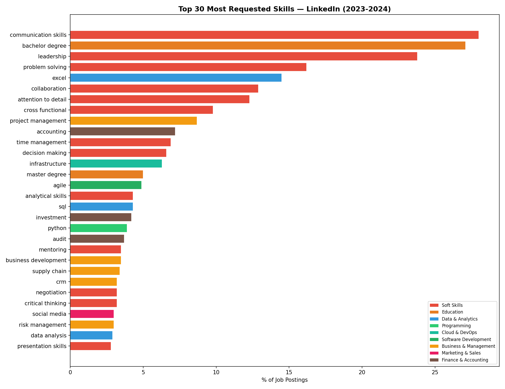

# Experience-Level Classification & Skill Analytics for LinkedIn Job Postings

> An end-to-end NLP pipeline over ~119k LinkedIn job postings (2023–2024): a curated skill taxonomy, a skill-based job recommender, and a five-class **ordinal** seniority classifier — a TF-IDF + Logistic Regression baseline versus a Bidirectional LSTM, evaluated with ordinal-aware metrics, a McNemar significance test, a title-leakage experiment, and SHAP-based explainability.


---

## Overview

Online job markets encode a lot of structured knowledge in unstructured text: a single posting names the role, lists required skills, hints at a salary band, and states a seniority level. This project turns that free text into structured, queryable intelligence.

The pipeline is organised around three connected goals:

1. **Skill & market analytics** — build a hand-curated taxonomy of **172 skills across 11 categories**, measure which skills are most in demand and how the mix shifts across seniority, and quantify how salary varies by skill with explicit (bootstrap) uncertainty.
2. **Job recommendation** — given a candidate's skill profile, recommend the most relevant postings via skill-vector similarity, evaluated honestly with P@10 (unknown-level postings excluded from precision).
3. **Seniority classification** — the core task: a five-class, **ordinal** text-classification problem (`Entry < Associate < Mid-Senior < Director < Executive`), solved first with a classical baseline and then with a deep recurrent model, compared rigorously.

Two facts about the data drive nearly every design decision: seniority levels are **ordered** (an Entry-vs-Associate error is milder than Entry-vs-Executive), and the classes are **severely imbalanced** (Executive is just 1.34% of the labelled data).

---

## Key results

Seniority classification, evaluated on a held-out test set. **MAE is in levels (lower is better);** QWK is quadratic-weighted Cohen's κ.

| Model | macro-F1 | Accuracy | MAE (levels) ↓ | QWK |
|---|:---:|:---:|:---:|:---:|
| LogReg — title + description | 0.671 | 0.734 | 0.393 | 0.702 |
| LogReg — description only | 0.628 | 0.711 | 0.429 | 0.674 |
| **BiLSTM — title + description (dampened weights)** | **0.713** | **0.781** | **0.310** | **0.773** |
| BiLSTM — description only (dampened weights) | 0.602 | 0.707 | 0.451 | 0.631 |

**The Bidirectional LSTM (title + description) wins on every metric**, beating the baseline by a statistically significant margin (McNemar **χ² = 190.4, p ≈ 2.6 × 10⁻⁴³**) while training in only a few minutes on a GPU.

**Honest finding — the leakage experiment.** Removing the job title (the *description-only* variant) collapses the BiLSTM from macro-F1 0.713 → 0.602, a much larger drop than the baseline suffers. This shows the model leans heavily on title tokens (e.g. "senior", "director", "vice president"), and quantifies how much of the apparent accuracy is really the title naming the answer.

---

## Visual highlights

<p align="center">
  
  
</p>

<p align="center">
  
  
</p>

<p align="center">
  
</p>

*(Confusion matrix errors hug the diagonal, confirming the model respects the ordinal structure; SHAP surfaces the tokens each seniority class keys on; salary estimates carry explicit bootstrap confidence intervals.)*

---

## Repository structure

```
.
├── README.md
├── requirements.txt
├── .gitignore
├── notebooks/
│   └── experience_level_classification.ipynb   # the full end-to-end pipeline
├── figures/
│   ├── confusion_matrix.png
│   ├── training_curves.png
│   ├── shap_importance.png
│   ├── top_skills_global.png
│   ├── tech_vs_soft_skills.png
│   ├── skills_by_level.png
│   └── salary_by_skill_ci.png
├── models/
│   ├── skill_taxonomy.pkl            # 172-skill taxonomy
│   ├── skill_vocab.pkl
│   ├── tfidf_vectorizer.pkl          # baseline + recommender
│   ├── binary_vectorizer.pkl
│   ├── label_encoder.pkl
│   ├── final_model_comparison.csv    # the results table above
│   ├── linkedin_lstm_model.keras     # (gitignored — see "Data & model files")
│   └── tokenizer.pkl                 # (gitignored — see "Data & model files")
├── reports/
│   ├── report.pdf
│   └── presentation.pdf
└── data/
    └── (job_postings.csv goes here — download from Kaggle, see below)
```

---

## Methodology

**Data & cleaning.** The corpus is the public LinkedIn Job Postings (2023–2024) dataset (123,849 raw rows, ~970 MB). After lower-casing, stripping HTML/URLs/boilerplate, normalising salaries to a yearly figure, and removing 4,836 duplicates plus 44 further rows (37 unrealistic salaries, 7 missing critical fields), **118,969 postings** remain. Two parallel text fields are kept per posting: `full_text` (title + description + skills) and `desc_text` (description + skills only). Keeping the title out of the second field is what enables the leakage experiment.

**The central challenge — imbalance.** `Mid-Senior` (44.9%) and `Entry` (39.1%) make up ~84% of labelled data; `Associate` is 10.7%, `Director` 4.0%, and `Executive` just **1.34%**. About a quarter of postings carry no usable seniority label and are excluded from the supervised task (used only by the recommender), leaving **88,647 labelled postings** for classification.

**Imbalance handling.** Square-root-dampened class weights — e.g. the raw Executive weight of ~15 is dampened to ~3.9 — to lift the rare classes without destabilising training.

**Ordinal-aware evaluation.** Because the target is ordered, the project reports **MAE-in-levels** and **quadratic-weighted Cohen's κ (QWK)** alongside accuracy and macro-F1, so that "near misses" are scored more gently than far-off errors.

**Statistical rigour.** A **McNemar test** compares the BiLSTM against the baseline on paired predictions, confirming the improvement is significant rather than noise.

**Explainability.** **SHAP** surfaces the most influential tokens per predicted class, making the model's seniority cues interpretable (see `shap_importance.png`).

**Engineering note.** The original BiLSTM used `recurrent_dropout`, which silently disables Keras's fast cuDNN LSTM kernel. Removing it restored the cuDNN path and cut training from **~85 min/epoch to ~25 sec/epoch** — turning an overnight job into a few-minute one with no loss in quality.

---

## Reproducing the results

> Originally developed in **Google Colab** with a GPU runtime. It runs locally too, given a GPU for the BiLSTM (CPU works but is slower).

**1. Clone and set up an environment**

```bash
git clone https://github.com/<your-username>/linkedin-job-postings-nlp.git
cd linkedin-job-postings-nlp

python -m venv .venv
source .venv/bin/activate          # Windows: .venv\Scripts\activate
pip install -r requirements.txt
```

**2. Get the dataset**

The raw `job_postings.csv` (~516 MB) is **not** in this repo. Download the *LinkedIn Job Postings (2023–2024)* dataset from Kaggle and place the CSV at:

```
data/job_postings.csv
```

**3. Run the notebook**

```bash
jupyter notebook notebooks/experience_level_classification.ipynb
```

If you run it outside Colab, update the path constant near the top of the notebook (`BASE = ...`) to point at your local `data/` and `models/` folders.

---

## Tech stack

`Python` · `pandas` · `NumPy` · `scikit-learn` (TF-IDF, Logistic Regression) · `TensorFlow / Keras` (Bidirectional LSTM) · `statsmodels` (McNemar) · `SHAP` (explainability) · `matplotlib` / `seaborn`

---

## Authors & acknowledgements

- **Andrea Bardini**
- **Filippo Maria Incecchi**

Course project for **Artificial Intelligence**, MSc in *Analytics and Data Science for Economics and Management*, **Università degli Studi di Brescia** — supervised by **Prof. Angela Locoro** (June 2026).

---

## Data & model files

To keep the repository lightweight and within GitHub's limits, two categories of large files are intentionally excluded (see `.gitignore`):

- **`data/job_postings.csv` (~516 MB)** — exceeds GitHub's 100 MB file limit and is publicly available on Kaggle. Download it yourself (instructions above).
- **`models/linkedin_lstm_model.keras` (~47 MB) and `models/tokenizer.pkl` (~12 MB)** — the trained BiLSTM and its tokenizer. The notebook regenerates both in minutes. If you'd rather ship them with the repo, track them with [Git LFS](https://git-lfs.com):

  ```bash
  git lfs install
  git lfs track "*.keras" "models/tokenizer.pkl"
  git add .gitattributes models/linkedin_lstm_model.keras models/tokenizer.pkl
  ```

The small artifacts (vectorizers, label encoder, skill taxonomy, results CSV) are kept in the repo so the baseline and recommender run without retraining.

---

## License

The **code** in this repository is released under the MIT License. The **LinkedIn Job Postings dataset** is subject to its own license/terms on Kaggle — please review those before redistributing any data.
